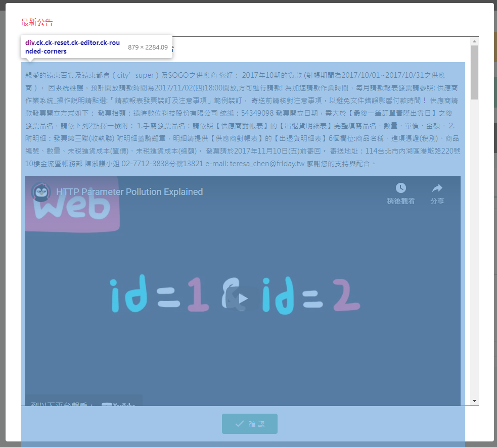
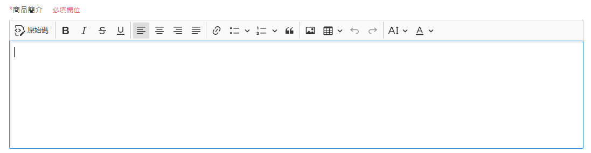
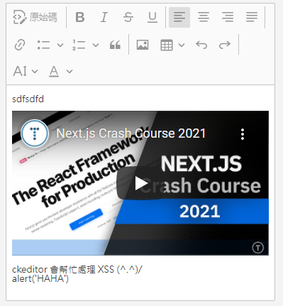

# 富文本編輯器 ( ckeditor5 )

專案中的富文本編輯器 使用 [ckeditor5](https://ckeditor.com/ckeditor-5/)

:::danger 警示
因為專案中有用 reset.css , 因此 ckeditor 元件需要被包在 `<div class="unreset"></div>` 中
:::

## 快速開始

### 引入第三方套件

`ckeditor.js` 檔案要從 [online-builder](https://ckeditor.com/ckeditor-5/online-builder/) 上設定 & 下載

將下方的 js 引入到 html 中 , 即可開始使用 `ckeditor` 元件

```html
  <!-- 引用 ckeditor 5 -->
  <script src="/js/ckeditor.js"></script>

  <!-- 引入 form_common.js -->
  <script src="/js/form_common.js"></script>
```

### 使用 ckeditor5

需要在 html 先設定一個 textarea 然後再將 ckeditor 掛載上去

✳ 下方列表一些常用的 html 格式

🟢 沒有外框

> 效果圖



> 程式碼

```html title="index_layout_v1.html"
<div class="unreset">
  <textarea class="ckeditor" name="popup_announcement"></textarea>
</div>
```

```js title="index_layout_v1.js"
// Init CKEditor
window.ckeditorCtrl.initEditor()
window.ckeditorCtrl.addEditor($('textarea[name="popup_announcement"]').get(0), 'noToolBar')

// 因為初始化 ckeditor 需要時間 , 因此等個 0.1 秒 , 再將 html 塞入 ckeditor 中
setTimeout(() => {

  const popupHtml = `
    <p>
      親愛的遠東百貨及遠東都會（city’super）及SOGO之供應商 您好：
      2017年10期的貨款
      (對帳期間為2017/10/01~2017/10/31之供應商），
      因系統維護，預計開放請款時間為2017/11/02(四)18:00開放,方可進行請款!
      為加速請款作業時間，每月請款報表發票請參照:
      供應商作業系統_操作說明請點選:「請款報表發票裝訂及注意事項」範例裝訂，
      寄送前請核對注意事項，以避免文件錯誤影響付款時間！
      供應商請款發票開立方式如下：
      發票抬頭：遠時數位科技股份有限公司
      統編：54349098
      發票開立日期，需大於【最後一筆訂單實際出貨日】之後
      發票品名，請依下列2點擇一檢附：
      1.手寫發票品名：請依照【供應商對帳表】的【出退貨明細表】完整填寫品名、數量、單價、金額。
      2.附明細：發票第三聯(收執聯) 附明細蓋騎縫章，明細請提供【供應商對帳表】的【出退貨明細表】6個欄位:商品名稱、進項憑證(稅別)、商品編號、數量、未稅進貨成本(單價)、未稅進貨成本(總額)。
      發票請於2017年11月10日(五)前寄回。
      寄送地址：114台北市內湖區港墘路220號10樓金流暨帳務部 陳淑謙小姐 02-7712-3838分機13821
      e-mail: teresa_chen@friday.tw
      感謝您的支持與配合。
    </p>
    <figure class='media'>
      <oembed url='https://www.youtube.com/embed/QVZBl8yxVX0'></oembed>
    </figure>
    <figure class='media'>
      <oembed url='https://www.youtube.com/embed/QVZBl8yxVX0'></oembed>
    </figure>
  `

  // 處理內容 popup 的 ckeditor ( ex: 設定內容資料 )
  window.ckeditorCtrl.getEditor('popup_announcement').setData(popupHtml)

}, 100)
```


🟢 可以編輯

> 效果圖



> 程式碼

```html title="product_single_add.html"
<textarea class="ckeditor" name="product_content"></textarea>
```

```js title="product_single_add.js"
// Init CKEditor
window.ckeditorCtrl.initEditor()
window.ckeditorCtrl.setUploadUrl('https://example.com/圖片上傳網址')
window.ckeditorCtrl.addEditor(document.querySelector('textarea[name="product_content"]'))
```


🟢 純顯示

> 效果圖



> 程式碼

```html title="product_modify_search.html"
<textarea class="ckeditor" name="product_content"></textarea>
```

```js title="product_modify_search.js"
// Init CKEditor
window.ckeditorCtrl.initEditor()
window.ckeditorCtrl.addEditor($('textarea[name="product_content"]').get(0), 'readOnly')

// 因為初始化 ckeditor 需要時間 , 因此等個 0.1 秒 , 再將 html 塞入 ckeditor 中
setTimeout(() => {

  const testHtml = `
      <p>sdfsdfd</p>
      <figure class='media'>
        <oembed url='https://www.youtube.com/watch?v=mTz0GXj8NN0&t=784s'></oembed>
      </figure>
      <div>ckeditor 會幫忙處理 XSS (^.^)/ </div>
      <script>alert('HAHA')</script>
  `

  // 處理內容 popup 的 ckeditor ( ex: 設定內容資料 )
  window.ckeditorCtrl.getEditor('product_content').setData(testHtml)

}, 100)
```

### 專案中客製化的樣式

- [x] 設定最大高度
- [x] error 時顯示紅框
- [x] 用 .unreset 避免 h1 . h2 樣式無法生效

- 詳細樣式請參考 `src\scss\_ckeditor.scss` 或是 `src\scss\_ckedit.scss` 樣式檔

## 參考資料

- [bootstrap-datetimepicker 官方文件](https://getdatepicker.com/4/Options/#defaultDate)