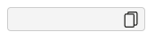

# 文字複製 ( clipboard_input)

文字複製使用 class Name clipboard-input 賦予 input 可以複製文字的按鈕功能

## 快速開始

將下方的 css 跟 js 引入到 html 中 , 即可開始使用 `clipboard_input` 元件

```html
<!-- 引用 jquery -->
<script src="/js/jQuery.js" type="text/javascript"></script>

<!-- 引入 filter-select.js & 其樣式 -->
<link rel="stylesheet" href="/css/app.css" />
<link rel="stylesheet" href="/css/form.css" />
<link rel="stylesheet" href="/js/form_common.js" />
```

### 使用 clipboard_input

clipboard_input 的 html 基本格式為 `<input class="clipboard-input" type="text" value=""/><i class="copy"></i>`

✳ 下方為 pug 格式

```pug
input.clipboard-input(type='text')
i.copy
```

文字複製的前台樣式


### 在 app.css 引用以下的樣式

```scss
input.clipboard-input + i.copy {
  top: 5px;
  left: -30px;
  position: relative;
  cursor: pointer;
}

i.copy {
  display: inline-block;
  width: 18px;
  height: 18px;
  background-size: contain;
  background-repeat: no-repeat;
  background-image: url(data:image/svg+xml;base64,PD94bWwgdmVyc2lvbj0iMS4wIiBlbmNvZGluZz0iaXNvLTg4NTktMSI/Pg0KPCEtLSBHZW5lcmF0b3I6IEFkb2JlIElsbHVzdHJhdG9yIDE4LjAuMCwgU1ZHIEV4cG9ydCBQbHVnLUluIC4gU1ZHIFZlcnNpb246IDYuMDAgQnVpbGQgMCkgIC0tPg0KPCFET0NUWVBFIHN2ZyBQVUJMSUMgIi0vL1czQy8vRFREIFNWRyAxLjEvL0VOIiAiaHR0cDovL3d3dy53My5vcmcvR3JhcGhpY3MvU1ZHLzEuMS9EVEQvc3ZnMTEuZHRkIj4NCjxzdmcgdmVyc2lvbj0iMS4xIiBpZD0iQ2FwYV8xIiB4bWxucz0iaHR0cDovL3d3dy53My5vcmcvMjAwMC9zdmciIHhtbG5zOnhsaW5rPSJodHRwOi8vd3d3LnczLm9yZy8xOTk5L3hsaW5rIiB4PSIwcHgiIHk9IjBweCINCgkgdmlld0JveD0iMCAwIDIxMC4xMDcgMjEwLjEwNyIgc3R5bGU9ImVuYWJsZS1iYWNrZ3JvdW5kOm5ldyAwIDAgMjEwLjEwNyAyMTAuMTA3OyIgeG1sOnNwYWNlPSJwcmVzZXJ2ZSI+DQo8Zz4NCgk8cGF0aCBzdHlsZT0iZmlsbDojMUQxRDFCOyIgZD0iTTE2OC41MDYsMEg4MC4yMzVDNjcuNDEzLDAsNTYuOTgxLDEwLjQzMiw1Ni45ODEsMjMuMjU0djIuODU0aC0xNS4zOA0KCQljLTEyLjgyMiwwLTIzLjI1NCwxMC40MzItMjMuMjU0LDIzLjI1NHYxMzcuNDkyYzAsMTIuODIyLDEwLjQzMiwyMy4yNTQsMjMuMjU0LDIzLjI1NGg4OC4yNzENCgkJYzEyLjgyMiwwLDIzLjI1My0xMC40MzIsMjMuMjUzLTIzLjI1NFYxODRoMTUuMzhjMTIuODIyLDAsMjMuMjU0LTEwLjQzMiwyMy4yNTQtMjMuMjU0VjIzLjI1NEMxOTEuNzYsMTAuNDMyLDE4MS4zMjgsMCwxNjguNTA2LDB6DQoJCSBNMTM4LjEyNiwxODYuODU0YzAsNC41NTEtMy43MDMsOC4yNTQtOC4yNTMsOC4yNTRINDEuNjAxYy00LjU1MSwwLTguMjU0LTMuNzAzLTguMjU0LTguMjU0VjQ5LjM2MQ0KCQljMC00LjU1MSwzLjcwMy04LjI1NCw4LjI1NC04LjI1NGg4OC4yNzFjNC41NTEsMCw4LjI1MywzLjcwMyw4LjI1Myw4LjI1NFYxODYuODU0eiBNMTc2Ljc2LDE2MC43NDYNCgkJYzAsNC41NTEtMy43MDMsOC4yNTQtOC4yNTQsOC4yNTRoLTE1LjM4VjQ5LjM2MWMwLTEyLjgyMi0xMC40MzItMjMuMjU0LTIzLjI1My0yMy4yNTRINzEuOTgxdi0yLjg1NA0KCQljMC00LjU1MSwzLjcwMy04LjI1NCw4LjI1NC04LjI1NGg4OC4yNzFjNC41NTEsMCw4LjI1NCwzLjcwMyw4LjI1NCw4LjI1NFYxNjAuNzQ2eiIvPg0KPC9nPg0KPGc+DQo8L2c+DQo8Zz4NCjwvZz4NCjxnPg0KPC9nPg0KPGc+DQo8L2c+DQo8Zz4NCjwvZz4NCjxnPg0KPC9nPg0KPGc+DQo8L2c+DQo8Zz4NCjwvZz4NCjxnPg0KPC9nPg0KPGc+DQo8L2c+DQo8Zz4NCjwvZz4NCjxnPg0KPC9nPg0KPGc+DQo8L2c+DQo8Zz4NCjwvZz4NCjxnPg0KPC9nPg0KPC9zdmc+DQo=);
}
```

### 在 form_common.js 內引用以下程式碼

```js
// Copy Text To Clipboard
function clickToClipboard(e) {
  if (e.value === "") {
    return false;
  }
  const copyText = e;
  copyText.select();
  copyText.setSelectionRange(0, 99999); /* For mobile devices */
  document.execCommand("copy");
  alert(copyText.value + "已複製到剪貼簿！");
}
```

### JS 常用方法

在使用時在該頁面的 xxx.js 加上以下的 js

```js
// 文字複製
$("input.clipboard-input + i.copy").on("click", (e) =>
  clickToClipboard(e.currentTarget.previousElementSibling)
);
```
