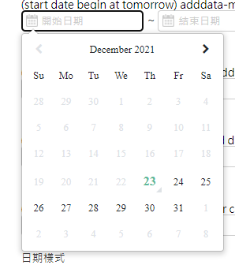

# 日期選單 ( date_picker )

日期選單使用 [bootstrap-datetimepicker](https://getdatepicker.com/4/Options/#defaultDate) 套件 , 並且在其之上進行加工


:::danger 警示
`bootstrap-datetimepicker` 是早期的元件 , 他會將 datePicker 附加到 `<input type="text">` 旁邊 ,
因此如果 wrapper 有 overflow : 'hidden' 或 'scroll' 樣式時 datePicker 會被遮住需要注意
:::

## 快速開始

### 引入第三方套件

將下方的 css 跟 js 引入到 html 中 , 即可開始使用 `date_picker` 元件

```html
  <!-- 引用 jquery -->
  <script src="/js/jQuery.js" type="text/javascript"></script>

  <!-- 引用 bootstrap-datetimepicke -->
  <link rel="stylesheet" href="/css/bootstrap-datetimepicker.min.css">
  <script src="/js/bootstrap.min.js"></script>
  <script src="/js/moment.min.js"></script>
  <script src="/js/bootstrap-datetimepicker.min.js"></script>

  <!-- 引入 form_common.js -->
  <script src="/js/form_common.js"></script>
```

### 使用 datePicker

datePicker 的 html 基本格式為 `<input type="text" data-date-format>`

✳ 下方列表一些常用的 html 格式

🟢 限制最小日期

設定最小日期為明天 ( today+1 天 )

```html
<input data-date-format="YYYY-MM-DD" type="text" data-min-date='+1' placeholder="開始日期" autocomplete="off">
```



🟢 只能選擇月份

```html
<input data-date-format="YYYY-MM" type="text" placeholder="開始日期" autocomplete="off">
```

🟢 一組起訖日

當同一個 HTML 元素中放多個 `<input type="text" data-date-format>` 就會自動認定為一組的起迄日

```html title="起訖日 LIMIT - 起日不能大於迄日 , 迄日不能小於起日"
<div>
  <input data-date-format="YYYY-MM-DD" type="text" name="start_date" placeholder="開始日期" autocomplete="off">
  <input data-date-format="YYYY-MM-DD" type="text" name="end_date" placeholder="開始日期" autocomplete="off">
</div>
```

🟢 起訖日限制範圍

設定起訖日不能大於 180 天 ( data-range-date 只有放在 end_date 上才會生效 )

```html
<div>
  <input data-date-format="YYYY-MM-DD" type="text" name="start_date" placeholder="開始日期" autocomplete="off">
  <input data-date-format="YYYY-MM-DD" type="text" name="end_date" data-range-date="+180" placeholder="開始日期" autocomplete="off">
</div>
```

🟢 其他 JS 中常用的設定

```javascript title="JS 中的一些設定"
// 詳細的日期計算請參考 : https://momentjs.com/docs/#/manipulating/
$('start_date').data('DateTimePicker').minDate(moment().subtract(2, 'y')) // 起始日的最小日期為 2 年前
$('end_date').data('DateTimePicker').maxDate(moment().add(6, 'd')) // 結束日的最大日期為 6 天後
$('start_date').data('DateTimePicker').date(moment()) // 起始日的預設日期為今天
```

### 🔹 HTML 屬性

#### 🟢 data-date-format ( data-min-date="YYYY-MM-DD" )

| 格式 | 顯示 |
|--|--|
| YYYY-MM-DD | 2021-04-08 |
| HH:mm:ss.SSS | 16:07:09.057 |

詳細的日期格式對照 , 請參考 [moment 官方文件](https://momentjs.com/docs/)

#### 🟢 data-min-date ( data-min-date="+5" )

設定最小日期為 today+n 天

#### 🟢 data-range-date ( data-range-date="+180" )

設定起訖日不能大於 n 天

:::caution 注意事項
data-range-date 只有放在 end_date 上才會生效
:::

### 🔹 JS 常用方法

```javascript title="JS 中的一些設定"
// 詳細的日期計算請參考 : https://momentjs.com/docs/#/manipulating/
$('start_date').data('DateTimePicker').minDate(moment().subtract(2, 'y')) // 起始日的最小日期為 2 年前
$('end_date').data('DateTimePicker').maxDate(moment().add(6, 'd')) // 結束日的最大日期為 6 天後
$('start_date').data('DateTimePicker').date(moment()) // 起始日的預設日期為今天
```
