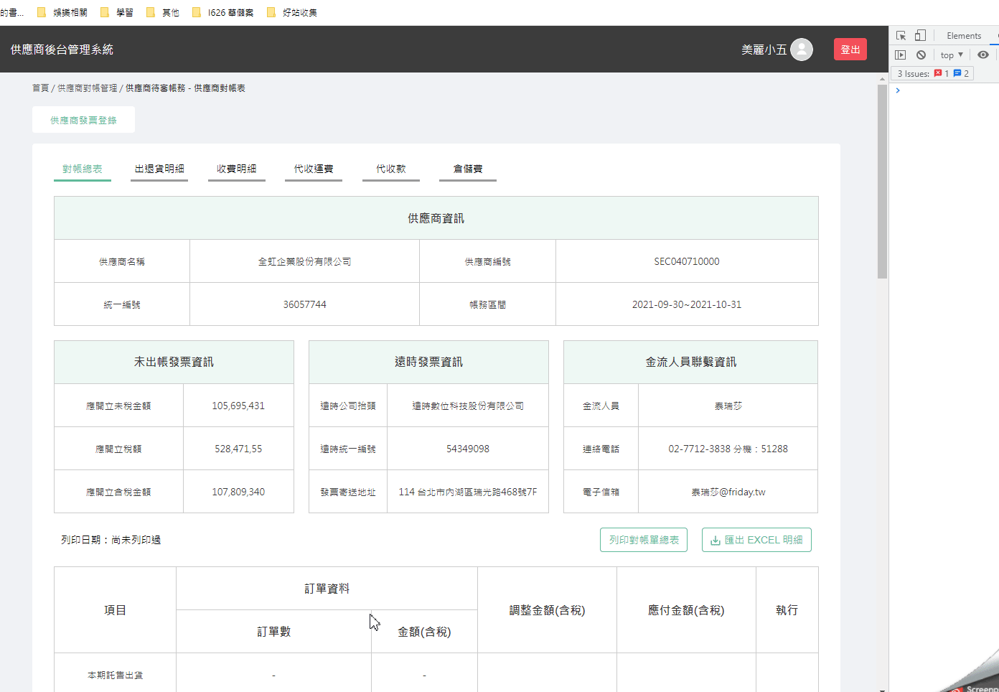
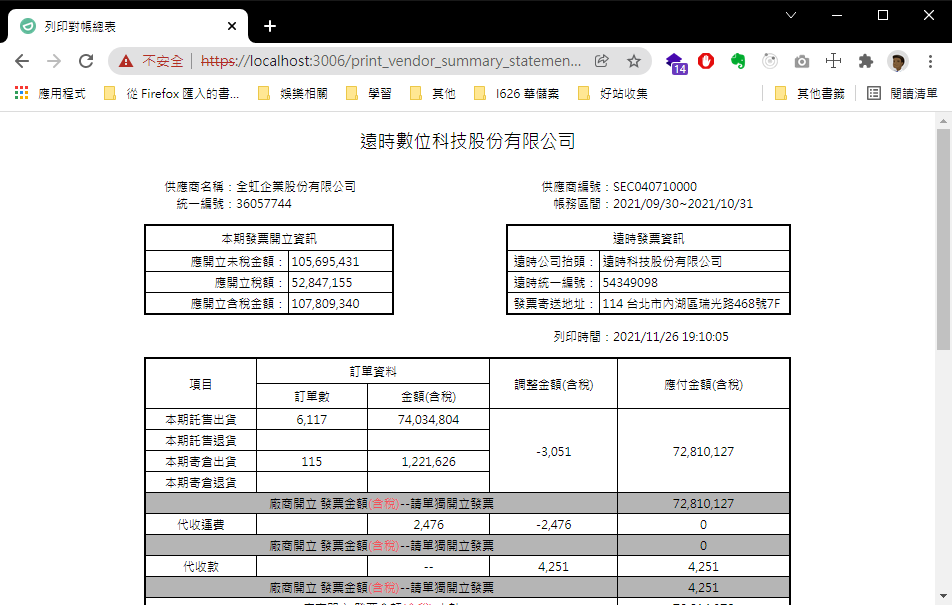

# 列印功能 ( PrintCtrl.print )

## 需求

利用前端直接叫出列印的選單 & 指定列印內容為 `對帳總表` 或是其他的報表

> 列印總表


## 呈現效果



## 快速開始

### 第三方套件

列印功能我們有引用 [print.js](https://printjs.crabbly.com/) . [html2canvas](https://html2canvas.hertzen.com/)
. [jsPdf](https://github.com/parallax/jsPDF) 這 3 個第三方套件

因此需要先將其引入到 html 中

```html title="引用第三方套件"
<!-- local 的版本 -->
<script src="/js/jspdf-2.4.0.min.js" type="text/javascript"></script>
<script src="/js/html2canvas-1.3.3.min.js" type="text/javascript"></script>
<script src="/js/print.min.js" type="text/javascript"></script>
<link href="/css/print.min.css" rel="stylesheet"/>
<script src="/js/form_common.js" type="text/javascript"></script>

<!-- cdn 的版本 -->
<script src="https://unpkg.com/jspdf@2.4.0/dist/jspdf.umd.min.js" type="text/javascript"></script>
<script src="https://html2canvas.hertzen.com/dist/html2canvas.min.js" type="text/javascript"></script>
<script src="https://printjs-4de6.kxcdn.com/print.min.js" type="text/javascript"></script>
<link href="https://printjs-4de6.kxcdn.com/print.min.css" rel="stylesheet"/>
<script src="/js/form_common.js" type="text/javascript"></script>
```

### 切版 HTML

我們需要建立一個 print_XXX 的 pug 檔案 , 當作符合 A4 列印的頁面

以列印 `對應總表` 為例 , 我們需要多切版一個頁面 `print_vendor_summary_statement.html` 當作列印 A4 頁面所使用的版型



如果要製作其他報表來列印 , 需要切板新的 HTML 頁面

:::caution 注意事項

- 📒 A4 頁面為固定大小 , 尺寸為 `210 x 297 mm` = `793.7007874026 x 1122.51968504082 px`
- 📒 目前單頁的常用大小為 `647 x 1024 px` 跟 `793 x 1122 px` 兩種尺寸 , 請選其中一種尺寸來切版
- [📝注一：mm 轉 px 計算機](https://www.unitconverters.net/typography/centimeter-to-pixel-x.htm)
- 📒 PrintCtrl.print 利用 `.main` 當作分頁的錨點 , 因此命名自定義樣式名稱時 , 請勿用 `.main`
- 📒 列印專用頁 , 請勿在上面加上 JS

:::

### 呼叫列印函式 ( PrintCtrl.print )

- 開箱使用

```javascript
// 使用 get 列印
new window.PrintCtrl().print({url: '/print_vendor_summary_statement.html'})

// 使用 post 列印
const printFn = async () => {

  LoadingBox.showSpinner()

  const htmlStr = await new window.PrintCtrl().getHtmlString({
    url: '/print_vendor_summary_statement.html',
    data: {param_1: '你的參數', param_2: 5566},
    method: 'post',
  })

  await new window.PrintCtrl().print({htmlStr})

  LoadingBox.hide()
}

printFn().then(console.log).catch(console.error)
```

- 說明

其實 `PrintCtrl().print` 只是對 3 個套件做包裝 , 讓列印的呼叫更簡單方便 ,

包裝的內容如下 :
- 1️⃣ 建立一個 iframe 將 body 內容塞入 or 用 url 準備好要列印的 html 內容
- 2️⃣ 藉由 html2canvas.js 將 iframe 裡面的 .main 區塊做截圖處理
- 3️⃣ 利用 jsPdf 將剛剛的圖片 , 塞入 pdf 中並將其設定成 A4 的 1 頁
- 4️⃣ 利用 print.js 打開 列印介面 並將剛剛的 pdf 當成要列印的內容
