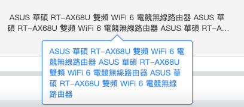
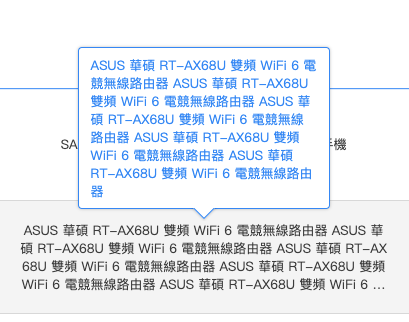

# 提示文字 ( tooltip )

## 緣起

scm3 跟 ecm 有許多需要在 tooltip 功能 , 因此前端團隊引用 jbox 的 `tooltip` 元件並客製化

提示文字使用 class Name tooltip 賦予 inline 元素有 tooltip 的效果

## 快速開始

將下方的 css 跟 js 引入到 html 中 , 即可開始使用 `tooltip` 元件

```html
<!-- 引用 jquery -->
<script src="/js/jQuery.js" type="text/javascript"></script>

<!-- 引入 js & 其樣式 -->
<link rel="stylesheet" href="/css/app.css" />
<link rel="stylesheet" href="/js/form_common.js" />

-----

<link href="/css/jbox.css" rel="stylesheet" />
<link href="/css/app.css" rel="stylesheet" />
<link href="/css/form.css" rel="stylesheet" />

<script src="/js/jQuery.js" type="text/javascript"></script>
<script src="/js/common.ui.js" type="text/javascript"></script>
<script src="/js/jbox.min.js"></script>

<script src="/js/form_common.js" type="text/javascript"></script>
```

form_common.js 內 與 Tooltip 相關的程式碼如下

```js
// 全局jBox
const myTooltip = new jBox("Tooltip", {
  attach: ".tooltip",
  adjustPosition: true,
  outside: "y",
  position: {
    y: "bottom",
  },
  maxWidth: "250px",
  onCreated: function () {
    registerScrollPosition($("#right-side > .header-wrapper + .content"), this);
  },
});

// ajax 撈資料時，可以呼叫 attachTooltip 讓有需要浮水層的 html element 能有 tooltip 的效果
window.attachTooltip = () => myTooltip.attach(".tooltip", "mouseenter");
```

提示文字 的 html 結構如下

```html
<p class="tooltip" title="測試文字1234567890">測試文字1234567890</p>
```

提示文字 的 pug 結構如下

```pug
p.tooltip(title="測試文字1234567890")

```

### 使用 tooltip

tooltip 的 html 基本格式為 `<p class="tooltip" title="測試文字1234567890">`

✳ 下方列表一些常用的 html 格式

🟢 限制最多兩行，超過的文字顯示...

```html
<p class="word-break tooltip two" title="測試文字1234567890"></p>
```

前台顯示最多兩行樣式，超過的文字顯示...


🟢 限制最多四行，超過的文字顯示...

```html
<p class="word-break tooltip four" title="測試文字1234567890"></p>
```

前台顯示最多四行樣式，超過的文字顯示...

